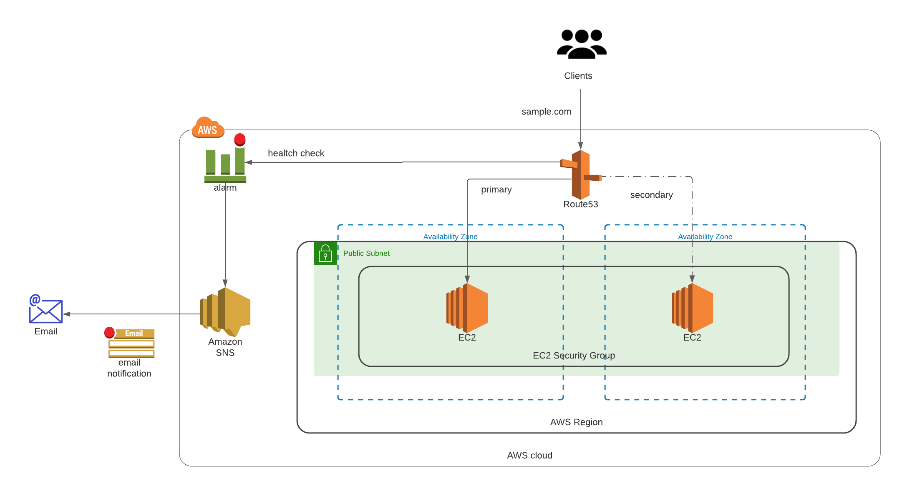

## Summary

This repo will create and set up your DNS resources with failover and notification.

## Basic Architecture



## Built with:

* Terraform (v1.0.4)
* AWS_ACCESS_KEYS and AWS_SECRET_ACCESS_KEYS are set as environment variables (link: https://docs.aws.amazon.com/cli/latest/userguide/cli-configure-envvars.html)

### Step by Step deployment
* **Step 1: Clone the Repo**. This command will clone the repo and will change directory the recently cloned repo
```shell script
$ git clone https://github.com/antonio-rufo/tf-javanew-dns.git
```

* **Step 2: Update your tfvars.** Update the `terraform.tfvars` file with your aws_account_id and region (optional).
```shell script
$ cd tf-javanew-dns/environment
$ vi terraform.tfvars
```

* **Step 3: Create the test environment.** Update the `main.tf` file with your details.
```shell script
$ vi main.tf
```
Create your SNS topic and subscribers. Update the SNS topic name to whatever you like and update the email as well, you can input multiple entries in the email attribute. Afterwards, you'll have to accept the invite in your email/s:
```shell script
module "sns_topic" {
  source  = "../modules/sns"

  name  = "route53-health-check"
  email = ["sample@gmail.com"]
}
```
Create your health checks and cloudwatch alarms, please do note route53 health checks are only in us-east-1. Input your dns_name target in the script below and update the health_check_path, as need be. This module will automatically create 2 types of health check and alarm (HTTP and HTTPS):
```shell script
module "route53_health_check" {
  source = "../modules/healthcheck"
  providers = {
    aws = aws.us-east-1
  }

  environment          = var.environment
  dns_name             = "sample.com"
  alarm_actions        = [module.sns_topic.sns_topic_arn]
  health_check_path    = "/"
  health_check_regions = ["us-east-1", "us-west-1", "us-west-2"]

  depends_on = [module.sns_topic]
}
```
Create your Public Zone, update the "public-zone-example1.com" with your domain name and update the comments attribute as well for the description:
```shell script
module "zone1" {
  source = "../modules/zones"

  zones = {
    "public-zone-example1.com" = {
      comment = "public-zone-example1.com - 1st public hosted zone"
    }
  }

  tags = local.tags
}
```
Create your records that will be created under your Public zone, if creating A records just update the IP Address/es. In the sample, it will automatically do a failover basing on the health check. In the main.tf, I've commented out combinations that you can use, which includes CNAME records:
```shell script
module "records_for_zone1" {
  source = "../modules/records"

  zone_name = local.zone_name

  records = [
    {
      name            = ""
      type            = "A"
      set_identifier  = "failover-primary"
      health_check_id = module.route53_health_check.http_healthcheck_id
      ttl            = 5
      records = [
        "3.208.22.61",
      ]
      failover_routing_policy = {
        type = "PRIMARY"
      }
    },
    {
      name           = ""
      type           = "A"
      set_identifier = "failover-secondary"
      ttl            = 5
      records = [
        "54.234.136.202",
      ]
      failover_routing_policy = {
        type = "SECONDARY"
      }
    }
  ]

  depends_on = [module.zone1, module.route53_health_check]
}
```
Create the resources:
```shell script
$ terraform init
$ terraform plan -var-file=./varconfig/vars.tfvars
$ terraform apply -var-file=./varconfig/vars.tfvars --auto-approve
```
